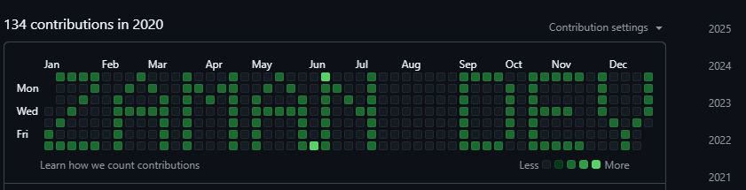

# Git Commit Art


## Screenshot



Git Commit Art is a Node.js script that allows you to create artistic patterns on the GitHub contribution graph by manipulating commit dates. This project is designed for **educational purposes** to explore Git's commit history mechanics and the behavior of the contribution graph.

> **Note:** Misusing this tool to artificially inflate contribution statistics or mislead others violates GitHub's terms of service and may result in account suspension.

---

## ✨ Features

- **Random Commits:** Generate a specified number of commits on random dates within the past year.
- **Custom Text Patterns:** Create commits on specific dates to form text patterns (e.g., "HACK") on the contribution graph.

---

## 🛠️ How It Works

- The script uses predefined 7x5 grid patterns for letters A-Z.
- For custom text commits, it calculates the dates corresponding to the cells needed to form the text on the contribution graph, starting from a user-specified date.

---

## 🚀 Getting Started

### 1. Prerequisites
- Install [Node.js](https://nodejs.org/)
- Initialize a Git repository and link it to GitHub.

### 2. Installation
Run the following command to install the required dependencies:
```bash
npm install jsonfile moment simple-git random readline
```

### 3. Running the Script
You can run the script using one of the following commands:

#### Option 1: Direct Execution
```bash
node git_commit_modifier.js
```

#### Option 2: With Specific Options
```bash
node git_commit_modifier.js --text "HACK" --start-date "2023-01-01"
```

#### Option 3: Using npm
```bash
npm run start
```
- This will prompt you to choose between **random commits** or **custom text commits**.
- For random commits, you will be asked to enter the number of commits and the start date.
- For custom text commits, you will input the desired text and start date.

---

## ⚠️ Ethical Considerations

- Use this tool **responsibly** and for **educational purposes only**.
- Avoid using it to misrepresent your contribution activity on GitHub.

---

## 🤝 Contributing

Contributions are welcome! To contribute:
1. Fork this repository.
2. Create a new branch for your feature or bug fix.
3. Submit a pull request with your changes.

---

## 📜 License

This project is licensed under the [MIT License](LICENSE).

---

## 📧 Contact

For questions or feedback, feel free to open an issue or submit a pull request.
